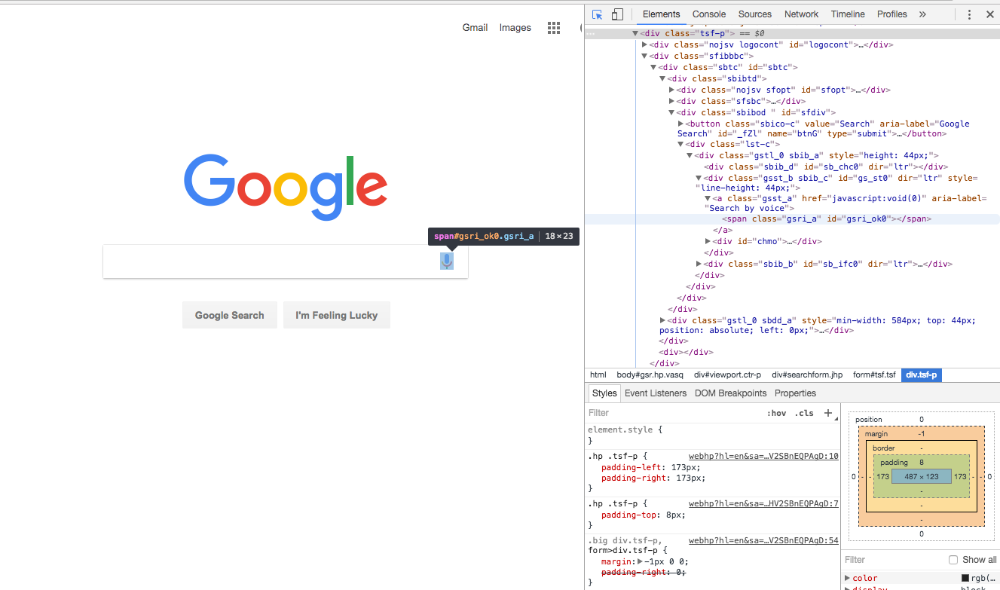

## Introduction to Chrome DevTools
#### Why is this important?
Using Chrome DevTools is a great way to debugg front-end files and view performance and test responsivness of your website.

####What are the objectives?
In this lesson, we will go over the most important features of Chrome Developer Tools. By the end of this lesson, you will be able to:
 - Explain what DevTools is and what each tab does
 - Inspect HTML, CSS and JavaScript
 - Add break points to DOM elements and JavaScript files
 - Write snippets

###Where should we be now?
Make sure you have Chrome installed. You should alse be familiar with basics of HTML, CSS and JavaScript and how they work together to create a web page.

## What is DevTools?
DevTools is a built in tool for developers in Chrome browser to do debugging and find detailed infomration about the a web application or a web page. It's consisted of multiple tabs and each one focus on a specific aspect of an app. You can explore the HTML/CSS used in the webpage to debug JavaScript and view network perfomance.
 
There are three way to open DevTools:

1. open your Chrome browser and click on the three bar icon on the right side of your address bar. Go to More Tools -> Developer Tools.
2. Right click anywhere on the page and select Inspect. This method will open the Elements tab and highlights the selected element on the page.
3. Use the shorcut : ` cmd + option + j `. This shortcut will always open the console tag. You can use `i` instead of `j` to start from the tab you left off before. 

<p align="center">
  
</p>
 
 
 Now go a head and open you DevTools using any of the 3 methods. As you can see there are 8 tabs avaibale and each one provides different set of information to help you debug or optimize your applications:


1. **Elements**: Inspect and edit the HTML & CSS of the DOM (Document Object Model)
2. **Console**: Run JavaScript in the browser
3. **Sources**: A graphical interface to the V8 debugger
4. **Network**: Evaluate network performance (refresh to see it in action)
5. **Timeline**: Evaluate page load performance (refresh to see it in action)
6. **Profiles**: Identify optimizations in the performance of an app or webpage.
7. **Application**: (Formerly "Resources"); Manage application storage
8. **Security**: Confirm whether the page you're viewing is secure
9. **Audits**: The Audit panel can analyze a page as it loads.

## Elements Tab
 In this tab you can inspect:
 - HTML structure of the page
 - CSS styles applied to each element
 - Box Model
 - Event Listeners
 - Element Properties

Go to <a href="https://google.com">google.com</a> and open the elements tab in your DevTools. spend a minute and explore the html elements in the page and try to find the styles applied to them.

As you can see, this tab provides a hirarical structure of the DOM. You can play around with the attributes,styles and find the size of each element in the page. This is a great way to find issues in the structural layer of your applications. Another important thing you can find in this tab is the EventListeners attached to each element.

## Console tab

Similar to using Elements tab for finding bugs with the layout, we use console tab to figure out JavaScript bugs and errors. You can run JavaScript code in the console as shown here:


(img source: [jsforcats.com](http://jsforcats.com/))

Also
Now spend a few minutes and go through [Command Line API Reference](https://developers.google.com/web/tools/chrome-devtools/console/command-line-reference) and learn how to use console and interact with DOM. 

Going back to google.com, let's open the console and follow along:

<details>
<summary> Let's select the microphone element in the search field. Can you name selector attached to it?
</summary>
```
document.getElementById('gsri_ok0');
```
</details>
<details>
<summary> Now let's make the microphone disappear!
</summary>
```
document.getElementById('gsri_ok0').style.visibility="hidden";;
```
</details>


###### Add break points to DOM
###### Add break points to js files
## concolusion
As you can see Chrome DevTools is a powerful tool for any web developer and knowing your way around it can help you pin point issues with your app faster. So make the DevTools your best friend!

- Explain what the Elements tab is and what kind of information it provides?
- If an event listerner does not responde to clicking,,where is the first place you check?
- How do you add breakpoints to a JavaScript file? Which tab you use?
- Explain what the networks tab does? 

## Resouces
- [Chrome DevTools reference](https://developers.google.com/web/tools/chrome-devtools/?utm_source=dcc&utm_medium=redirect&utm_campaign=2016q3)
- [More practise on DevTools](http://discover-devtools.codeschool.com/)
